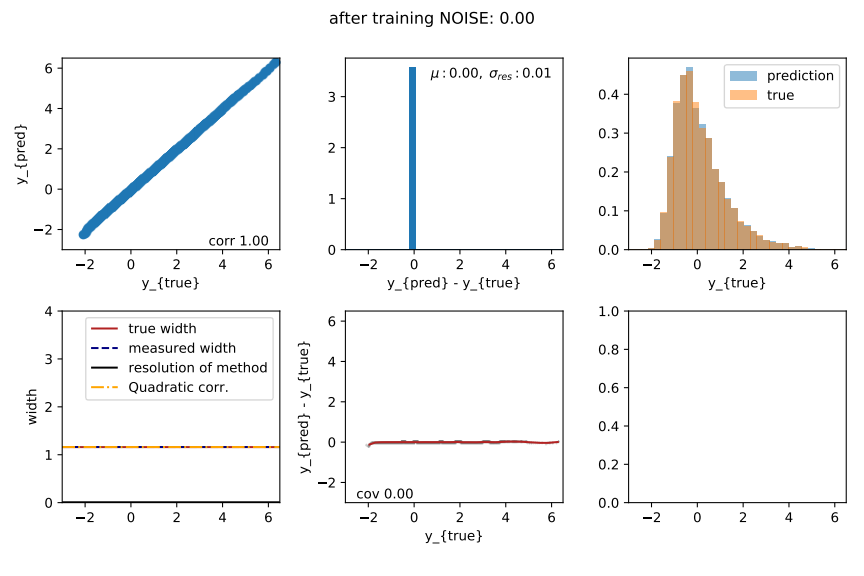
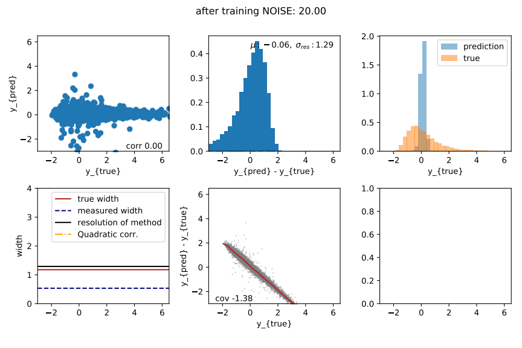
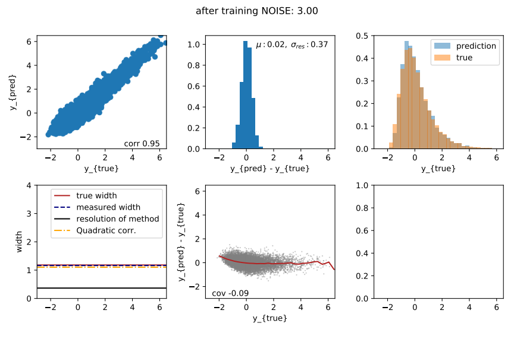

# DNN_learns_distribution

Re-produce the toy study about the reconstruction of Xmax distributions.

Install the requirements via:
```bash
pip install -r requirements.txt
```

Then run the file "DNN_learns_distribution.py".

Feel free to change the NOISE parameter

Note the training will run significantly faster on a GPU or a dedicated CPU.


If you have a GPU, don't forget to activate it using:

```bash
CUDA_VISIBLE_DEVICES=0
```

## Scenarios
Using the script, a simple NN is trained to learn a distribution, in this case, an Xmax distribution.
To understand the training dynamics, we review the three cases:
- no noise (perfect reconstruction),
- much noise (reconstruction not possible),
- moderate noise (descent reconstruction possible).

Hint: you can find the slides with all details here:
https://www.auger.unam.mx/AugerWiki/machine_learning?action=AttachFile&do=get&target=glombitza_2021_02_25.pdf


### No noise
If the noise is set to 0, the DNN can perfectly reconstruct the distribution.



### Much noise
Reconstruction is not possible since the label is fully superimposed by noise.
Now the DNN reconstructs only the mean of the target distribution. (This is ALWAYS possible. Basically, only the bias in the last layer is learned.)
This collapse towards a delta function located at the mean of the target distribution can be observed for a variety of MSE-trained estimators since this configuration has a smaller MSE than a broadened distribution.



### Moderate noise
The DNN can reconstruct the distribution. Note that the resolution of the method does NOT broaden the disitrbution.
The DNN is trained to learn the distribution directly, so it "corrects" for its resolutions automatically.

